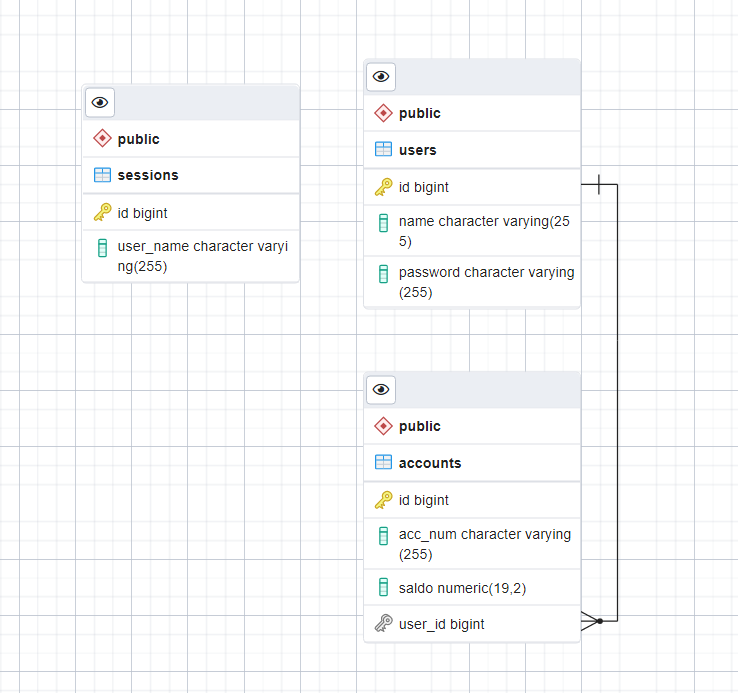

http://localhost:9091/swagger-ui.html#/

Реализован админский интерфейс с эндпоинтами:
1. Создание пользователей.
2. Создание счетов.
3. Запросы к БД без входа по имени-паролю.

Реализован пользовательский интерфейс с эндпоинтами:
1. Точка входа по паролю и имени. Открытие сессии.
2. Запрос всех счетов и остатков.
3. Внесение наличных.
4. Снятие наличных.
5. Проверка наличия активной сессии пользователя при каждом запросе.
Время жизни сессии пользователя - 3 минуты.

